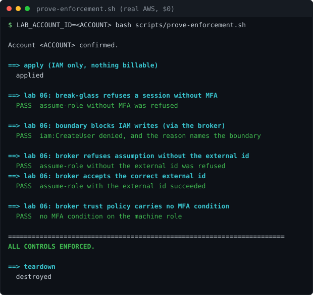

# Lab 06: IAM Least Privilege and Break Glass Broker Roles

<p align="center"></p>


[](https://github.com/ChromeData/IAM-Least-Privilege/actions/workflows/tests.yml)

**AWS roles built the way a PAM engineer thinks: a hard ceiling nothing can exceed, admin access that is read only until an incident, and a broker role with no standing credentials. Then proven minimal by two separate tools.**

| | |
|---|---|
| **Domains** | CyberArk/Idira, AWS |
| **Built on** | [terraform-aws-modules/iam](https://github.com/terraform-aws-modules/terraform-aws-iam) (Anton Babenko) |
| **Cost** | Under $1 (IAM objects are free). **Runtime** ~4 hours |
| **Status** | Enforcement PROVEN against real AWS: the boundary was observed denying iam:CreateUser and naming itself in the denial (findings/enforcement-proven-real-aws.txt). MFA and external-id conditions verified enforcing |

## Situation

A CyberArk engineer thinks in broker roles and break glass by default. AWS can express the same model, but most people build flat, over permissive roles and never verify.

## Task

Build the roles the PAM way, then prove they are minimal instead of claiming it.

## Action

Three pieces:

**The permission boundary, the ceiling.** No role beneath it can go past it, even if its own policy is broader. It allows a short list of services and flatly denies IAM, Organizations, and account actions, which is the escalation surface. This is the AWS version of a vault's outer control.

**Break glass admin, minimal until it is not.** Assumable only with MFA, one hour max session (not the twelve hour default), boundary applied. It starts with read only access. The point is that even admin break glass begins minimal and is raised only when a real incident needs it.

**DB broker, no standing credentials.** Assumable only with an external ID (a shared secret gate), one hour session, boundary applied. Access is brokered per use, never held.

## Result

Two tools verify it, both in CI. Checkov scans the Terraform and fails the build on a real finding, with two intentional boundary skips that each carry a written reason. IAM Access Analyzer validates the deployed policies.

**Applied for real** against LocalStack, which implements the IAM API locally at zero cost, then every control was read back from the API rather than trusted from the config. That found a bug nothing else did.`n`nThe db-broker trust policy came back carrying an MFA condition this configuration never set, because the upstream module defaults `role_requires_mfa` to true. Break-glass should require MFA, since a human assumes it. The broker is assumed by a service, and a service cannot present MFA, so that condition does not harden the role, it makes it unassumable by the only thing meant to use it. It would have deployed looking perfect and failed on first use. Fixed and re-verified.`n`nAn earlier bug came from `terraform validate`: the module argument is `role_permissions_boundary_arn`, not `permissions_boundary_arn`. Both are in the history.`n`nWhat LocalStack does not prove is enforcement, since it does not evaluate policy at request time. The `prove-denied` test still needs real AWS. Full output in [findings/localstack-apply-run.txt](./findings/localstack-apply-run.txt).

## What I did not build

The role module is Anton Babenko's. The boundary design, the break glass and broker models, the Checkov config, and the verification are mine.

## Run it

```bash
terraform -chdir=terraform init
terraform -chdir=terraform apply
checkov --config-file .checkov.yaml     # least privilege proof
terraform -chdir=terraform destroy
```

Needs Terraform 1.9+ and Python 3.

## Findings

`findings/` fills in on the first apply and Access Analyzer run. [LAB-NOTES.md](./LAB-NOTES.md) is the log.

## License

Lab code: MIT ([LICENSE](./LICENSE)). Upstream module stays Apache 2.0, credited above.
